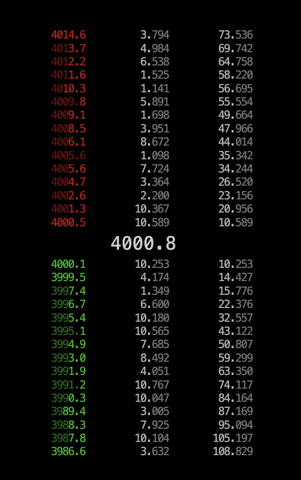

## Orderbook with d3 and React

[View it here!](https://orderbook.adaptable.app/)



To start locally:

```sh
npm install
npm run start:dev
```
This project visualises buys and sells in a eye-catching fashion. It recreates a real world problem that is often encountered in FinTech industry.

Data sources are in `src/orderbook/worker.js` which is a very simple web worker that will pump out fake orderbook data every `700ms`. It outputs an event object as follows:

```
{
  data: {
    asks: [[<price>, <amount>], ...],
    bids: [[<price>, <amount>], ...]
  }
}
```

Some of the values of the orderbook will be `float` or `int` - some will be exponential notation, to reflect data flakiness present in consumer applications.
